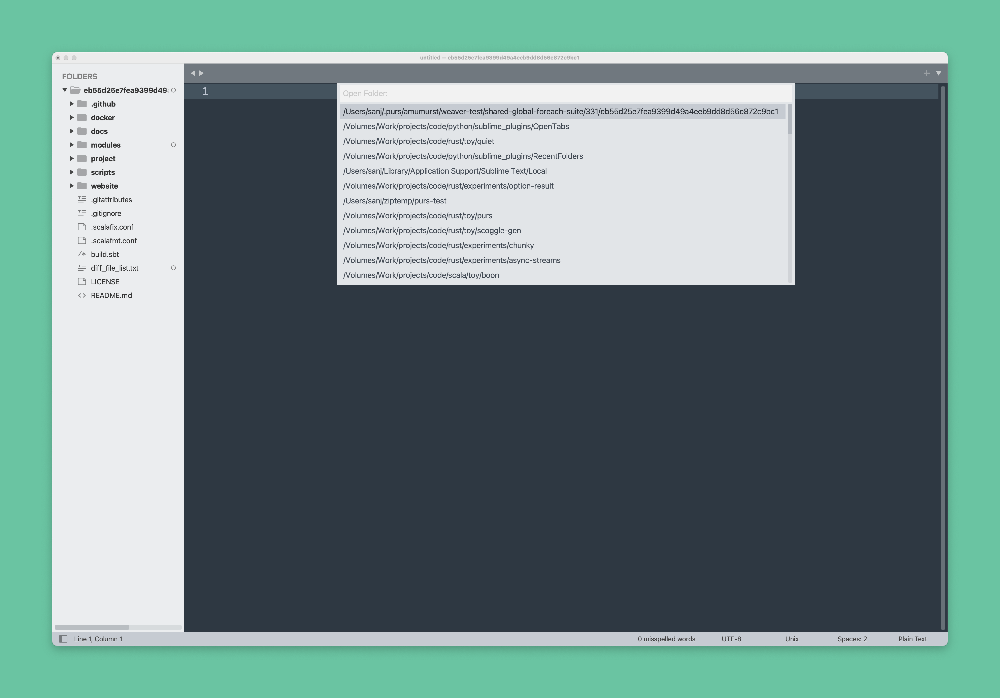

# RecentFolders

A [Sublime Text](https://www.sublimetext.com/) plugin to search across recently opened folders and open them.

## Installation

- Open the command palette with `CMD + SHIT + P`
- Select `Package Control: Add Repository`
- Enter https://github.com/ssanj/RecentFolders for the repository
- Select `Package Control: Install Package`
- Choose OpenTabs

## Functionality

To open a folder you have previously been working on, you need to go to `File` > `Open Recent` and select your folder from the menu. Using the mouse and menu is unnecessary if you could simply search for the folder you want to reopen. This is the functionality RecentFolder gives you.

### Search Recently Opened Folders

To search across recently opened folders `F10`.
